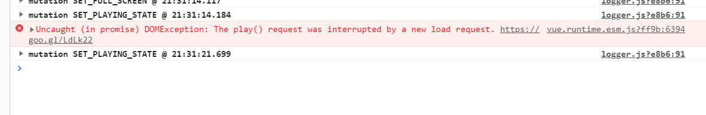

# cloud-music

> 自己在学习之余，尝试实现网易云音乐Android的APP

本项目建立在开源项目[NeteaseCloudMusicApi](https://github.com/Binaryify/NeteaseCloudMusicApi)的基础上, 需要先在本地起server

需要 NodeJS 6.0+ 环境，建议使用[NVM](https://github.com/coreybutler/nvm-windows/releases)进行node的版本管理

## server启动
- 下载
```
git clone https://github.com/Binaryify/NeteaseCloudMusicApi.git
```

- 安装依赖
```
npm install
```

- 启动项目
```
node app.js
```
服务器启动默认端口为 3000,若不想使用 3000 端口,可使用以下命令: Mac/Linux
```
$ PORT=4000 node app.js
```

windows 下使用 git-bash 或者 cmder 等终端执行以下命令:
```
set PORT=4000 && node app.js
```
或者进入项目中修改
```
const port = process.env.PORT || 3000;(此处的3000)
```

## 项目启动

``` bash
# install dependencies
npm install

# serve with hot reload at localhost:8080
npm run dev

# build for production with minification
npm run build

# build for production and view the bundle analyzer report
npm run build --report
```

For a detailed explanation on how things work, check out the [guide](http://vuejs-templates.github.io/webpack/) and [docs for vue-loader](http://vuejs.github.io/vue-loader).

## Cloud-music 项目开发问题

[问题详见](https://maxiang.io/)

1.  audio play pause状态切换时报错DOMException



- 解决方案：因为play()请求被pause()调用中断，所以我们需要延时操作
`this.$nextTick()` or `setTimeout(() => {}, timeout)`

